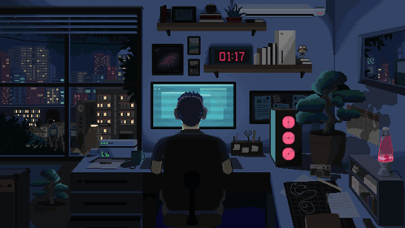
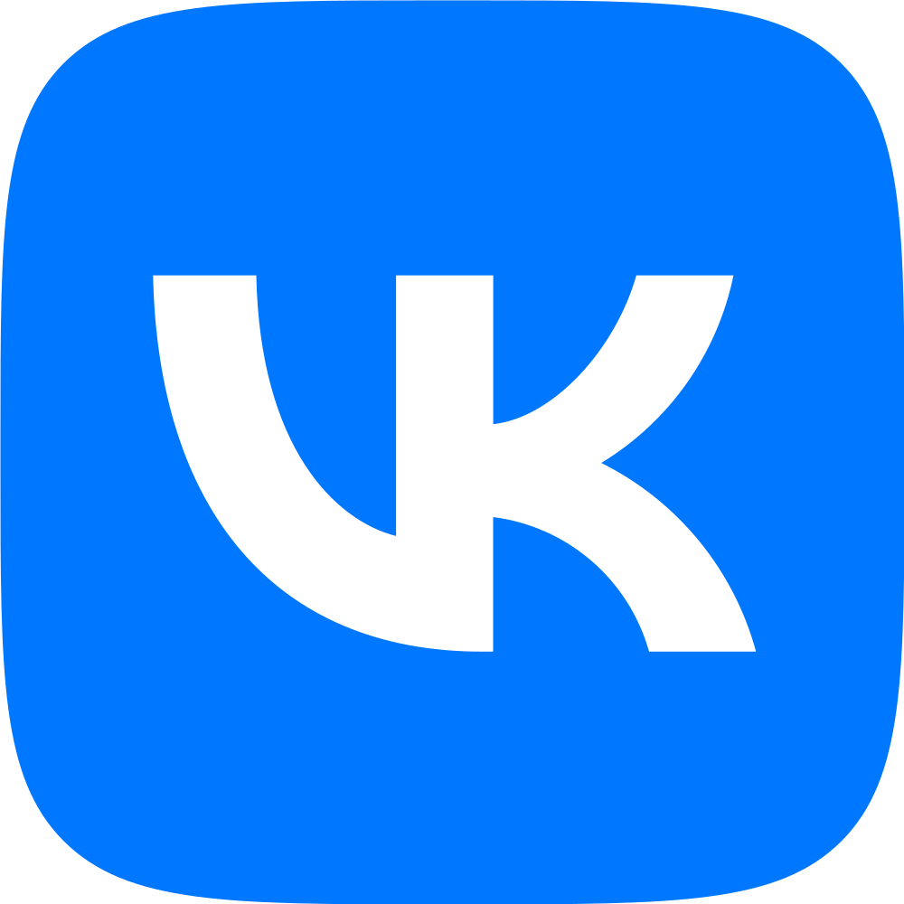
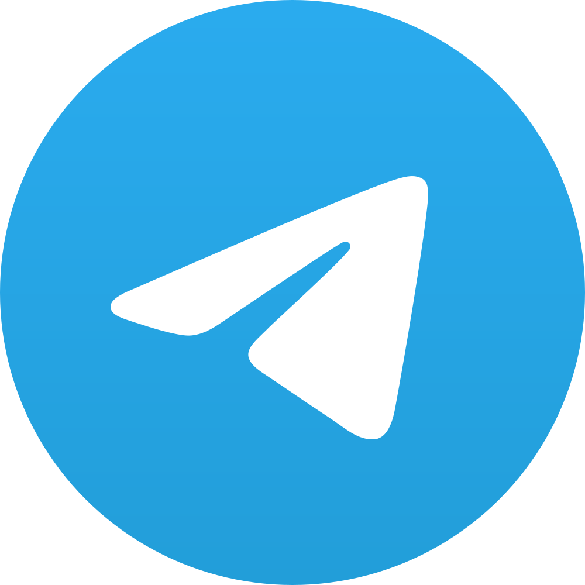

 

  

####

<h1 align="center">Привет👋 Меня зовут Владимир!</h1>

####

<h3 align="left">👩‍💻  Обо мне</h3>

####

Мой путь в тестировании начался в 2018 году с отладки носимой электроники - тогда я впервые столкнулся с проверкой качества, хотя и не осознавал этого как профессию. Позже, работая над автоматизированными обучающими системами, я осознанно погрузился в тестирование ПО: анализировал требования, искал баги, предлагал улучшения. Со временем я понял, что хочу не просто находить дефекты, но и автоматизировать их поиск, поэтому прошел курс по тестированию с переходом в автоматизацию. Сейчас я развиваюсь как QA Automation Engineer, пишу автотесты на Python, работаю с API и осваиваю современные инструменты, чтобы делать процесс тестирования быстрее и надежнее.

####

<h3 align="left">💻 Инструменты и технологии:</h3>

####

<h3 align="left">💬 Контакты:</h3>

  
  
  

<!--
**vvkozh/vvkozh** is a ✨ _special_ ✨ repository because its `README.md` (this file) appears on your GitHub profile.

Here are some ideas to get you started:

- 🔭 I’m currently working on ...
- 🌱 I’m currently learning ...
- 👯 I’m looking to collaborate on ...
- 🤔 I’m looking for help with ...
- 💬 Ask me about ...
- 📫 How to reach me: ...
- 😄 Pronouns: ...
- ⚡ Fun fact: ...
-->
